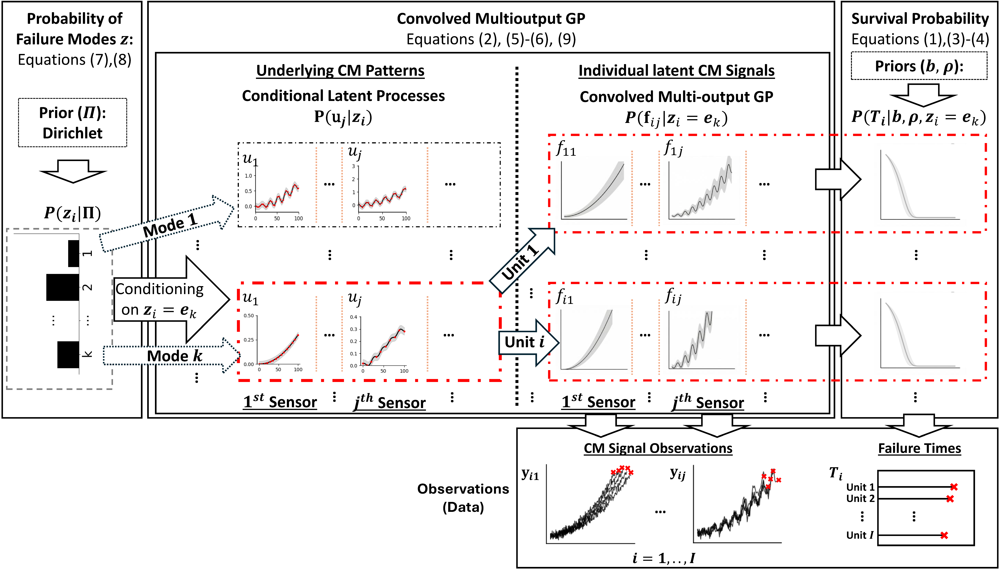

# Bayesian Joint Model of Multi-Sensor and Failure Event Data for Multi-Mode Failure Prediction

## 📄 Overview

This repository contains the implementation of **MFGPCox**, a unified Bayesian framework for jointly modeling:

1. **Time-to-event data** (failure times)  
2. **Condition-monitoring signals** from multiple sensors  
3. **Multiple Failure modes** (categorical outcomes)  

The model integrates:

- **Convolved Multi-output Gaussian Process (CMGP)** for modeling sensor signals  
- **Cox proportional hazards model** for survival analysis  
- **Multinomial distribution** for failure mode modeling  

within a **hierarchical Bayesian framework**, enabling accurate prediction and uncertainty quantification.

---

## 📄 Data Sources


---

## 📄 Model Framework



---

## 📄 Prediction Pipeline


---

## 📄 Repository Structure

1. `case_study/`  
Files for the case study, including CMGP hyperparameter optimization code and outputs, ELBO optimization code, prediction code, evaluation code, benchmark comparison files, and associated data/results.

2. `numerical_study/`  
Files for the numerical study, including data generation, CMGP hyperparameter optimization code and outputs, ELBO optimization code, prediction code, evaluation code, benchmark comparison files, and associated data/results.

3. `utils/`  
Shared Python utility modules used across the case study and numerical study workflows.

4. `requirements.txt`  
Python dependency list for the main code environment.

---

## 📄 Paper

This repository accompanies the following paper:

📌 https://doi.org/10.1080/00401706.2026.2653564  
(*Published in Technometrics, 2026*)

📌 https://arxiv.org/abs/2506.17036  
(*arXiv preprint*)

---

## 📄 Citation

If you use this code or find it helpful, please cite:

```bibtex
author = {Sina Aghaee Dabaghan Fard and Minhee Kim and Akash Deep and Jaesung Lee},
title = {Bayesian Joint Model of Multi-Sensor and Failure Event Data for Multi-Mode Failure Prediction},
journal = {Technometrics},
volume = {0},
number = {ja},
pages = {1--24},
year = {2026},
publisher = {Taylor \& Francis},
doi = {10.1080/00401706.2026.2653564},
}

